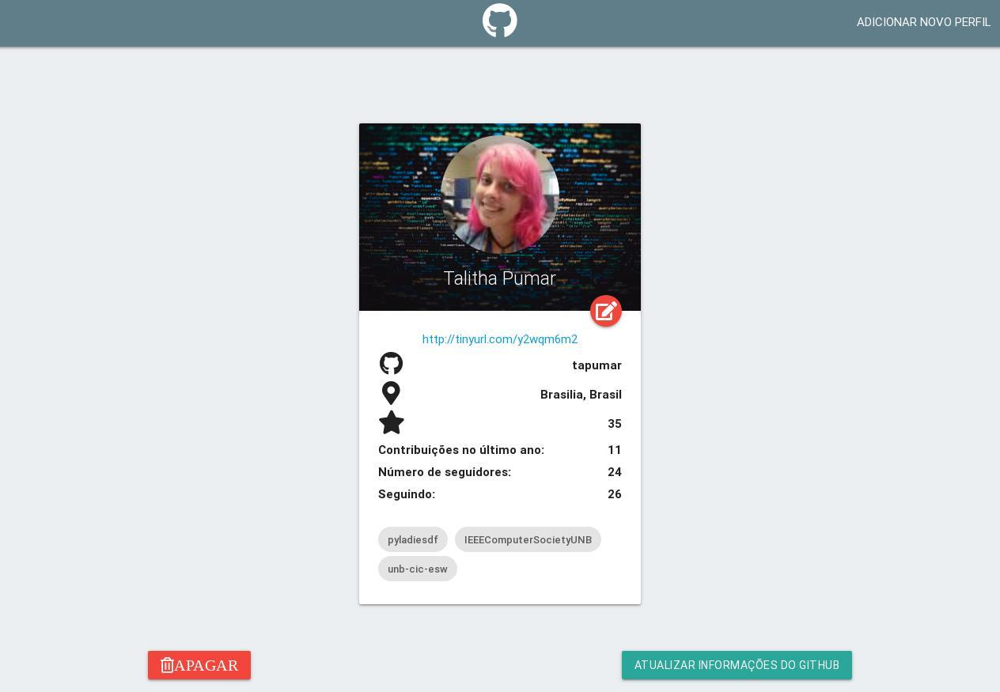

# Detalhamento de solução - Indexador de perfis do Github


### Instalação

**Pré-requisitos**

* [Git](https://git-scm.com/)
* [Docker](https://www.docker.com/get-docker)
* [Docker-composer](https://docs.docker.com/compose/install/#install-compose)

**Configuração**
* É necessário clonar o repositório com o comando

```
$ git clone https://github.com/IagoCarvalho/challenge_FS_rails.git
```

* Para subir a aplicação utilize o comando
```
$ docker-compose up
```

* Para execução dos próximos comandos é necessário identicar o CONTAINER-ID do contêiner web

```
sudo docker ps
```

* Para subir o postgreSQL
```
$ sudo docker exec -it CONTAINER-ID rake db:create
```
ou
```
$ docker-compose run web_rails rake db:create 
```

* Para criar as migrações
```
$ sudo docker exec -it CONTAINER-ID rails db:migrate
```

* A aplicação pode ser acessada na porta 3000 do seu localhost

```
http://localhost:3000/
```

* Para rodar os testes utilize o comando

```
sudo docker exec -it CONTAINER-ID rails test
```

## Tecnologias Utilizadas

* Rails                     version 5.2.4.3
* Ruby version              2.5.8-p224
* RubyGems version          3.0.3
* Rack version              2.2.3
* JavaScript Runtime        Node.js (V8)

## Descrição da solução



* Optou-se pela utlização do Docker devido o uso eficiente dos recursos do sistema quando comparado à VMs, além da portabilidade e facilidade para o desenvolvimento.

* Foram criados contêineres para desenvolvimento.

* Foi utilizada a gem shorturl, pela eficiência e documentação clara. A gem possui recursos para diversos serviços externos de encurtamento, sendo utilizado o tinyurl por não ser necessária a obtenção de uma api key para uso. Foi criado um método para tratar exceções de indisponibilidade de sistema, retornando a url original caso não seja possível encurtar a url pelo serviço.

* Foi utilizada a gem nokogiri para fazer o parse da página html, por ser um recurso bem documentado e com amplo suporte na comunidade para fazer *web scrapping*.

* Foi utilizado o banco de dados postgreSQL, pois com o cadastro de um perfil por vez a aplicação não demanda uma grande necessidade de escalabilidade. A experiência de trabalho com esse banco de dados e suas ferramentas também contribuiu para esta decisão.

* Não foram utilizados frameworks de front-end além do Materialize, devido à natureza simples da aplicação.
  

* Pontos de melhoria
  * Sistema de busca de perfil pode não ser eficiente para strings separadas por vírgulas ou palavras com acentuação.
  * Falta de experiência para documentação (comentários) adequada dos métodos.
  * Os testes foram focados no módulo de *web scrapping*, sendo ideal completar os testes restantes das *controllers*.
  * Falta de familiaridade com recursos padrões da linguagem pode ter limitado modularização e reaproveitamento de código.
  
* Limitações
  * Os atributos definidos como obrigatórios na documentação do problema não são verificados, logo perfis recém criados no github (sem informações de seguidores, stars, ...) não poderão ser importados imediatamente.
